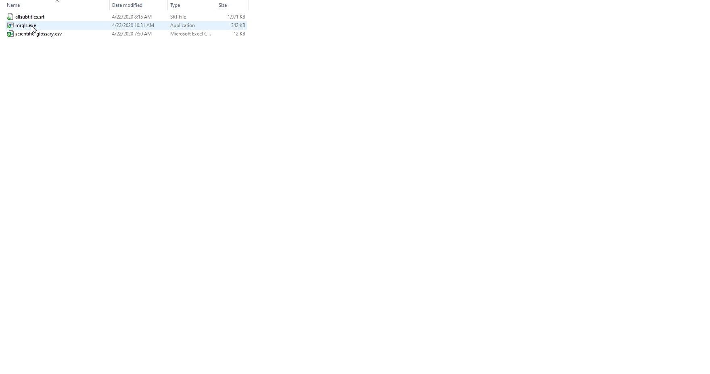

## Description
_mrgls_ is a small light-weight utility for arabic glossaries merge and completion based on _srt_ files content.

_mrgls_ offers the following services: 
- merges all _csv_ glossary files available in its working directory into one unique glossary
- performs a lookup in all _srt_ files available in its working directory of all vocalization, _Taa_ and _Hamza_ spelling variaties of every pre-existing glossary words, and adds them -organized- to the master glossary with no duplicates.

## Usage
Download the latest version of [_mrgls.exe_](https://github.com/Dev-Now/tarjamat-glossary-merger/releases).

Prepare your working directory by copying:
- _mrgls.exe_
- your _csv_ glossary files; the words must be listed on the first column starting from the second row (the first row being the header)
- all your _srt_ files for variations lookup

Execute _mrgls_ by double-clicking the executable.

The operation produces -after some time (depending on the content size and lookup complexity)- a _unified-glossary.csv_ file.

The operation produces also a  _log.txt_ providing logs about the operation.